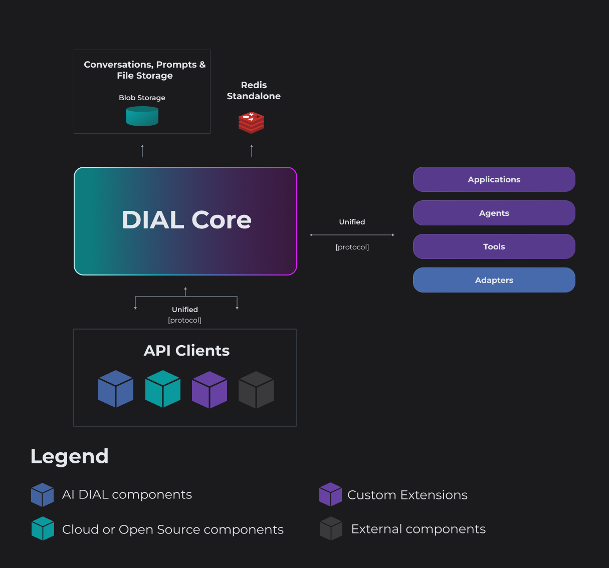

<h1 align="center">
         DIAL Core
    </h1>
    <p align="center">
        <p align="center">
        <a href="https://dialx.ai/">
          
        </a>
    </p>
<h4 align="center">
    <a href="https://discord.gg/ukzj9U9tEe">
        
    </a>
</h4>

- [Overview](#Overview)
- [OpenAPI Specification](#openapi-specification)
- [Build](#build-)
- [Run](#run-)
- [Helm Deployment](#helm-deployment)
- [Configuration](#configuration-)
    - [Static settings](#static-settings)
    - [Storage requirements](#storage-requirements)
    - [Dynamic settings](#dynamic-settings)
- [Claude Code commands](#claude-code-commands)
- [License](#license)


## Overview

> [!NOTE]
> HTTP Proxy provides unified API to different chat completion and embedding models and applications.
> Written in Java 21 and built on top of [Eclipse Vert.x](https://vertx.io/).



**[Read more about the DIAL Core](https://docs.dialx.ai/platform/core/about-core)**

---

## OpenAPI Specification

DIAL Core exposes an OpenAPI specification describing all available REST endpoints, request and response models, and common error responses.

The specification is generated automatically from the source code using the `openapi-generator` module. Do not edit the generated OpenAPI files manually, as any changes will be overwritten during the next generation.

The latest OpenAPI 3.0 specification is available in docs/open_api_core.yaml:
https://github.com/epam/ai-dial-core/blob/development/docs/open_api_core.yaml

### Preview endpoints

Endpoints that are still under development are marked with the vendor extension:

```yaml
x-preview: true
```

These endpoints are considered experimental and may change or be removed in future releases without backward compatibility guarantees.


## Build 🏗

DIAL Core has a dependency on GitHub packages of [JClouds](https://github.com/epam/jclouds).
Github doesn't provide anonymous [access to packages](https://github.com/orgs/community/discussions/26634#discussioncomment-8527086).

That requires to pass credentials GitHub for access to published JClouds packages. See the code snippet below:

```groovy
repositories {
        maven {
            url = uri("https://maven.pkg.github.com/epam/jclouds")
            credentials {
                username = project.findProperty("gpr.user") ?: System.getenv("GPR_USERNAME")
                password = project.findProperty("gpr.key") ?: System.getenv("GPR_PASSWORD")
            }
        }
        mavenCentral()
    }
```

> [!IMPORTANT]
> You should set env variables `GPR_USERNAME` and `GPR_PASSWORD` to valid values, where `GPR_USERNAME` - GitHub username and `GPR_PASSWORD` - GitHub personal access token.

> [!IMPORTANT]
> The access token requires the permission `read:packages`.
> 
> See more details [here](https://docs.github.com/en/authentication/keeping-your-account-and-data-secure/managing-your-personal-access-tokens) to generate personal access token in GitHub.

Build the project with Gradle and Java 21:

```
./gradlew build
```

---

## Run ▶️

Run the project with Gradle:

```
./gradlew :server:run
```

Or run [com.epam.aidial.core.server.AiDial](server/src/main/java/com/epam/aidial/core/server/AiDial.java) class from your favorite IDE.

---

## Helm Deployment

You have the option to deploy the DIAL Core on the Kubernetes cluster by utilizing an _umbrella_ [dial](https://github.com/epam/ai-dial-helm/blob/main/charts/dial/README.md) Helm chart, which also deploys other DIAL components. Alternatively, you can use [dial-core](https://github.com/epam/ai-dial-helm/blob/main/charts/dial-core/README.md) Helm chart to deploy just Core. 

> [!NOTE]
> Refer to [Examples](https://github.com/epam/ai-dial-helm/blob/main/charts/dial/examples/README.md) for guidelines.

In any case, in your Helm values file, it is necessary to provide application's configurations described in the [Configuration](#configuration) section.

---

## Configuration ⚙️

* [Static settings](#static-settings)
* [Dynamic settings](#dynamic-settings)

### Static settings

> [!NOTE]
> Static settings are used on startup and cannot be changed while application is running. Refer to [example](sample/aidial.settings.json) to view the example configuration file. 

Priority order:

1. Environment variables with extra "aidial." prefix. E.g. "aidial.server.port", "aidial.config.files".
2. File specified in "AIDIAL_SETTINGS" environment variable.
3. Default resource file: src/main/resources/aidial.settings.json.

| Setting                                  |      Default       | Required | Description                                                                                                                                                                                                                                                                                                     |
|------------------------------------------|:------------------:|:--------:|-----------------------------------------------------------------------------------------------------------------------------------------------------------------------------------------------------------------------------------------------------------------------------------------------------------------|
| config.files                             | aidial.config.json |    No    | List of paths to dynamic settings. Refer to [example](sample/aidial.config.json) of the file with [dynamic settings](#dynamic-settings).                                                                                                                                                                        |
| config.reload                            |       60000        |    No    | Config reload interval in milliseconds.                                                                                                                                                                                                                                                                         |
| vertx.*                                  |         -          |    No    | Vertx settings. Refer to [vertx.io](https://vertx.io/docs/apidocs/io/vertx/core/VertxOptions.html) to learn more.                                                                                                                                                                                               |
| server.*                                 |         -          |    No    | Vertx HTTP server settings for incoming requests. Refer to [HTTP server options](https://vertx.io/docs/apidocs/io/vertx/core/http/HttpServerOptions.html) to learn more.                                                                                                                                        |
| client.*                                 |         -          |    No    | Vertx HTTP client settings for outbound requests. Refer to [HTTP client options](https://vertx.io/docs/apidocs/io/vertx/core/http/HttpClientOptions.html) to learn more.                                                                                                                                        |
| webSocketClient.*                        |         -          |    No    | Vertx web socket client settings for outbound requests. Refer to [WebSocket client options](https://vertx.io/docs/apidocs/io/vertx/core/http/WebSocketClientOptions.html) to learn more.                                                                                                                        |
| invitations.ttlInSeconds                 |       259200       |    No    | Invitation time to live in seconds.                                                                                                                                                                                                                                                                             |
| perRequestApiKey.ttl                     |        1800        |    No    | The TTL in seconds of per request API key                                                                                                                                                                                                                                                                       |
| asyncTaskExecutor.useVirtualThreads      |        true        |    No    | The flag determines if virtual threads are used to run blocking tasks or platform threads.                                                                                                                                                                                                                      |
| config.jsonMergeStrategy.overwriteArrays |       false        |    No    | Specifies a merging strategy for JSON arrays. If it's set to `true`, arrays will be overwritten. Otherwise, they will be concatenated.                                                                                                                                                                          |
| apiKeyValidation.proxyCount              |         0          | No | The count of trusted proxies between the client and DIAL Core server. See [selecting an IP address in HTTP header X-Forwarded-For](https://developer.mozilla.org/en-US/docs/Web/HTTP/Reference/Headers/X-Forwarded-For#selecting_an_ip_address) for more details. The default value means there are no proxies. |
| mcpHttpClient.connectTimeout             |        10000        |    No    | Connect timeout in milliseconds for the shared `java.net.http.HttpClient` used when the server calls out to MCP servers (toolset tool listing/execution, API key sign-in validation).                                                                                                                          |
| analytics.collectClaims                  |       false        |    No    | If `true`, adds a `claims` object (`user_id`, `roles`, `user_display_name`) to each analytics log entry. **Note**: these claims may contain personal data (e.g. user id or display name); enable only where logging such data is acceptable.                                              |
| analytics.collectHeaders                 |       false        |    No    | If `true`, adds a `headers` object with the request headers to each analytics log entry, filtered by `analytics.headersAllowlist` / `analytics.headersBlacklist`. **Note**: enabling this may write sensitive data to logs; curate the lists for your setup.                                                                  |
| analytics.headersBlacklist               | ["authorization", "api-key", "cookie", "proxy-authorization"] | No | JSON array of case-insensitive regex patterns (full-match); request headers whose name matches any pattern are excluded when `analytics.collectHeaders` is enabled. Literal names (e.g. `authorization`) match themselves; use patterns like `x-stainless-.*` to drop a whole family of headers.                                                                                                                                                                           |
| analytics.headersAllowlist               |     _(disabled)_     | No | Optional JSON array of case-insensitive regex patterns (full-match). When present, only request headers whose name matches at least one pattern are collected (`analytics.headersBlacklist` still wins over the allowlist). Omit the key to disable the allowlist and collect all non-blocked headers. Example — keep just OTel and useful client headers: `["traceparent", "tracestate", "user-agent", "x-forwarded-.*"]`.                                                                                                                                                                           |


<details> 
<summary><b>Identity Providers Configurations</b></summary>

| Setting                                       | Default | Required | Description                                                                                                                                                                                                                                                                                                                                                                             |
|-----------------------------------------------|:-------:|:--------:|-----------------------------------------------------------------------------------------------------------------------------------------------------------------------------------------------------------------------------------------------------------------------------------------------------------------------------------------------------------------------------------------|
| identityProviders                             |    -    |   Yes    | Map of identity providers. **Note**: At least one identity provider must be provided. Refer to [examples](sample/aidial.settings.json) to view available providers. Refer to [IDP Configuration](https://github.com/epam/ai-dial/blob/main/docs/tutorials/2.devops/2.auth-and-access-control/2.configure-idps/0.overview.md) to view guidelines for configuring supported providers.    |
| identityProviders                             |    -    |   Yes    | Map of identity providers. **Note**: At least one identity provider must be provided. Refer to [examples](sample/aidial.settings.json) to view available providers. Refer to [IDP Configuration](https://github.com/epam/ai-dial/blob/main/docs/tutorials/2.devops/2.auth-and-access-control/3.configure-idps/0.overview.md) to view guidelines for configuring supported providers.    |
| identityProviders.*.jwksUrl                   |    -    | Optional | Url to jwks provider. **Required** if `disabledVerifyJwt` is set to `false`. **Note**: Either `jwksUrl` or `userInfoEndpoint` must be provided.                                                                                                                                                                                                                                         |
| identityProviders.*.userInfoEndpoint          |    -    | Optional | Url to user info endpoint. **Note**: Either `jwksUrl` or `userInfoEndpoint` must be provided or `disableJwtVerification` is unset. Refer to [Google example](sample/aidial.settings.json).                                                                                                                                                                                              |
| identityProviders.*.rolePath                  |    -    |   Yes    | Path(s) to the claim user roles in JWT token or user info response, e.g. `resource_access.chatbot-ui.roles` or just `roles`. Can be single String or Array of Strings. Refer to [IDP Configuration](https://github.com/epam/ai-dial/blob/main/docs/tutorials/2.devops/2.auth-and-access-control/2.configure-idps/0.overview.md) to view guidelines for configuring supported providers. |
| identityProviders.*.projectPath               |    -    |    No    | Path(s) to the claim in JWT token or user info response, e.g. `azp`, `aud` or `some.path.client` from which project name can be taken. Can be single String. Refer to [IDP Configuration](https://github.com/epam/ai-dial/blob/main/docs/tutorials/2.devops/2.auth-and-access-control/2.configure-idps/0.overview.md) to view guidelines for configuring supported providers.           |
| identityProviders.*.rolesDelimiter            |    -    |    No    | Delimiter to split roles into array in case when list of roles presented as single String. e.g. `"rolesDelimiter": " "`                                                                                                                                                                                                                                                                 |
| identityProviders.*.loggingKey                |    -    |    No    | User information to search in claims of JWT token. `email` or `sub` should be sufficient in most cases. **Note**: `email` might be unavailable for some IDPs. Please check your IDP documentation in this case.                                                                                                                                                                         |
| identityProviders.*.loggingSalt               |    -    |    No    | Salt to hash user information for logging.                                                                                                                                                                                                                                                                                                                                              |
| identityProviders.*.positiveCacheExpirationMs | 600000  |    No    | How long to retain JWKS response in the cache in case of successfull response.                                                                                                                                                                                                                                                                                                          |
| identityProviders.*.negativeCacheExpirationMs |  10000  |    No    | How long to retain JWKS response in the cache in case of failed response.                                                                                                                                                                                                                                                                                                               |
| identityProviders.*.issuerPattern             |    -    |    No    | Regexp to match the claim "iss" to identity provider.                                                                                                                                                                                                                                                                                                                                   |
| identityProviders.*.disableJwtVerification    |  false  |    No    | The flag disables JWT verification. *Note*. `userInfoEndpoint` must be unset if the flag is set to `true`.                                                                                                                                                                                                                                                                              |
| identityProviders.*.audience                  |    -    |    No    | If the setting is set it will be validated against the claim `aud` in JWT                                                                                                                                                                                                                                                                                                               |
| identityProviders.*.userDisplayName           |    -    |    No    | Path to the claim in JWT token or user info response where user display name can be taken.                                                                                                                                                                                                                                                                                              |
| identityProviders.*.userIdPath           |   sub   |    No    | Path to the claim in JWT token or user info response where user ID can be taken. Can differ based on each IDP. E.g. Microsoft Entra ID uses `oid`.                                                                                                                                                                                                                                                                                                        |

</details>

<details> 
<summary><b>Toolsets Security Configurations</b></summary>

| Setting                                           |      Default      | Required | Description                                                                                                                                                                                                                                                                                                                                                                                                              |
|---------------------------------------------------|:-----------------:|:--------:|--------------------------------------------------------------------------------------------------------------------------------------------------------------------------------------------------------------------------------------------------------------------------------------------------------------------------------------------------------------------------------------------------------------------------|
| toolsets.security.allowedRedirectUris             |        []         | Conditional | List of redirect URIs clients can provide during OAuth sign-in. A URI is accepted only if listed here or equal to the toolset's own `redirect_uri`; for dynamic client registration all URIs from this list are registered with the authorization server. **Required when more than one client can start a sign-in** (e.g. Chat and Admin panel), since a toolset can pin only one `redirect_uri` of its own.                                                                                                                                                                    |
| toolsets.security.authorizationServers            |         -         |    No    | Path(s) to the authorization server URLs trusted to issue access tokens for MCP clients.                                                                                                                                                                                                                                                                                                                                 |
| toolsets.security.resourceSchema                  |       https       |    No    | Schema of the resource server. This URL schema is used to construct the resource identifier for token validation, as defined in RFC 9728. If not specified, the default value will be applied.                                                                                                                                                                                                                           |
| toolsets.security.resourceHost                    |         -         |    No    | The public, fully-qualified hostname of this resource server (e.g., api.example.com). This is used to construct the resource identifier for token validation per RFC 9728. If not set, the host is derived from the incoming request.                                                                                                                                                                                    |
| toolsets.security.scopesSupported                 |         -         |    No    | List of scope values, as defined in OAuth 2.0 [RFC6749], that are used in authorization requests to request access to this protected resource.                                                                                                                                                                                                                                                                           |
| toolsets.security.kms.provider                    |    unencrypted    |    No    | Specifies KMS provider. Supported providers: aws, azure, gcp, unencrypted                                                                                                                                                                                                                                                                                                                                                |
| toolsets.security.kms.keyId                       |         -         |    No    | Identifies the KMS key to use in the encryption operation.                                                                                                                                                                                                                                                                                                                                                               |
| toolsets.security.kms.region                      |         -         |    No    | Geo region where the KMS is located. **Required** if `provider` is set to `aws`.                                                                                                                                                                                                                                                                                                                                         |
| toolsets.security.kms.encryptionAlgorithm         |         -         |    No    | Encryption algorithm. **Required** if `provider` is set to `azure`. **Note** Refer to [aws](https://docs.aws.amazon.com/kms/latest/APIReference/API_Encrypt.html#API_Encrypt_RequestSyntax), [azure](https://learn.microsoft.com/en-us/java/api/com.azure.security.keyvault.keys.cryptography.models.keywrapalgorithm) to get the list of supported algorithms for azure. Default value for `aws` is `SYMMETRIC_DEFAULT` |
| toolsets.security.kms.cache.enabled               |       true        |    No    | The flag determines if CEK cache is enabled.                                                                                                                                                                                                                                                                                                                                                                             |
| toolsets.security.kms.cache.maxSize               |       10000       |    No    | Maximum number of cached CEK.                                                                                                                                                                                                                                                                                                                                                                                            |
| toolsets.security.kms.cache.expiration            |      600000       |    No    | Expiration in milliseconds for cached CEK.                                                                                                                                                                                                                                                                                                                                                                               |
| toolsets.security.encryption.algorithm            |        AES        |    No    | The encryption algorithm to use for content encryption operations. Commonly `"AES"`, but may be changed to support other algorithms supported by the JCE provider.                                                                                                                                                                                                                                                       |
| toolsets.security.encryption.keySize              |        256        |    No    | Key size in bits for the encryption algorithm. For AES, valid values are 128, 192, or 256, depending on the algorithm and provider policy.                                                                                                                                                                                                                                                                               |
| toolsets.security.encryption.cipherTransformation | AES/GCM/NoPadding |    No    | The cipher transformation specifying the algorithm, mode, and padding (e.g., `"AES/GCM/NoPadding"`). Must be compatible with the selected algorithm.                                                                                                                                                                                                                                                                     |
| toolsets.security.encryption.ivLengthBytes        |        12         |    No    | Length of the initialization vector (IV) in bytes. For AES-GCM, 12 bytes (96 bits) is recommended by NIST.                                                                                                                                                                                                                                                                                                               |
| toolsets.security.encryption.gcmTagLengthBits     |        128        |    No    | Length of the authentication tag in bits when using GCM mode. NIST recommends 128 bits for maximum integrity protection.                                                                                                                                                                                                                                                                                                 |

</details>

<details> 
<summary><b>Storage Configurations</b></summary>

| Setting                     |  Default   | Required | Description                                                                                                                                                                                        |
|-----------------------------|:----------:|:--------:|----------------------------------------------------------------------------------------------------------------------------------------------------------------------------------------------------|
| storage.provider            | filesystem |   Yes    | Specifies blob storage provider. Supported providers: s3, aws-s3, azureblob, google-cloud-storage, filesystem. See examples in the sections below.                                                 |
| storage.endpoint            |     -      | Optional | Specifies endpoint url for s3 compatible storages. **Note**: The setting might be required. That depends on a concrete provider.                                                                   |
| storage.identity            |     -      | Optional | Blob storage access key. Can be optional for filesystem, aws-s3, google-cloud-storage providers. Refer to [sections in this document](#aws-s3-blob-store) dedicated to specific storage providers. |
| storage.credential          |     -      | Optional | Blob storage secret key. Can be optional for filesystem, aws-s3, google-cloud-storage providers.                                                                                                   |
| storage.bucket              |     -      |    No    | Blob storage bucket.                                                                                                                                                                               |
| storage.overrides.*         |     -      |    No    | Key-value pairs to override storage settings. `*` might be any specific blob storage setting to be overridden. Refer to [examples](#temporary-credentials-1) in the sections below.                |
| storage.createBucket        |   false    |    No    | Indicates whether bucket should be created on start-up.                                                                                                                                            |
| storage.prefix              |     -      |    No    | Base prefix for all stored resources. The purpose to use the same bucket for different environments, e.g. dev, prod, pre-prod. Must not contain path separators or any invalid chars.              |
| storage.maxUploadedFileSize | 536870912  |    No    | Maximum size in bytes of uploaded file. If a size of uploaded file exceeds the limit the server returns HTTP code 413                                                                              |

</details>

<details> 
<summary><b>Encryption Configurations</b></summary>

| Setting           | Default | Required | Description                                                                                                            |
|-------------------|:-------:|:--------:|------------------------------------------------------------------------------------------------------------------------|
| encryption.secret |    -    |    No    | Secret is used for AES encryption of a prefix to the bucket blob storage. The value should be random generated string. |
| encryption.key    |    -    |    No    | Key is used for AES encryption of a prefix to the bucket blob storage. The value should be random generated string.    |

</details>

<details> 
<summary><b>Resources Configurations</b></summary>

| Setting                                 | Default  | Required | Description                                                                                        |
|-----------------------------------------|:--------:|:--------:|----------------------------------------------------------------------------------------------------|
| resources.maxSize                       | 67108864 |    No    | Max allowed size in bytes for a resource.                                                          |
| resources.maxSizeToCache                | 1048576  |    No    | Max size in bytes for a resource to cache in Redis.                                                |
| resources.syncPeriod                    |  60000   |    No    | Period in milliseconds, how frequently check for resources to sync.                                |
| resources.syncDelay                     |  120000  |    No    | Delay in milliseconds for a resource to be written back in object storage after last modification. |
| resources.syncBatch                     |   4096   |    No    | How many resources to sync in one go.                                                              |
| resources.cacheExpiration               |  300000  |    No    | Expiration in milliseconds for synced resources in Redis.                                          |
| resources.compressionMinSize            |   256    |    No    | Compress a resource with gzip if its size in bytes more or equal to this value.                    |
| resources.resourceTypesExpiration       |      |    No    | Define expiration time per resource type in milliseconds                                           |
| resources.resourceTypesExpiration.FILE |      |  5 mins  | Define expiration time for files                                                                   |
| resources.resourceTypesExpiration.CONVERSATION |      |  5 mins  | Define expiration time for converations                                                            |
| resources.resourceTypesExpiration.PROMPT |      |  5 mins  | Define expiration time for prompts                                                                 |
| resources.resourceTypesExpiration.APPLICATION |      | 30 days  | Define expiration time for applications                                                            |
| resources.resourceTypesExpiration.TOOL_SET |      | 30 days  | Define expiration time for toolsets                                                                |

</details>

<details> 
<summary><b>Complex Resource Limits Configurations</b></summary>

Per-resource limits for folder-as-resource complex resources (e.g. skills), enforced on whole-resource
PUT and single-file PUT. Exceeding a limit rejects the request and leaves nothing observable written.
These limits also bound listing reads, archive (ZIP download) size and how long a mutation holds the
resource lock (a single-file PUT copies the whole current version under the lock).

| Setting                            | Default  | Required | Description                                                      |
|-------------------------------------|:--------:|:--------:|--------------------------------------------------------------------|
| complexResource.maxFiles           |   100    |    No    | Max number of files a complex resource may contain.               |
| complexResource.maxTotalBytes      | 16777216 |    No    | Max aggregate size in bytes of all files in a complex resource.   |
| complexResource.maxFileSizeBytes   | 1048576  |    No    | Max size in bytes of a single file within a complex resource.     |

</details>

<details> 
<summary><b>Complex Resource Sweep Configurations</b></summary>

Periodic job that reclaims storage for folder-as-resource complex resources (e.g. skills): it finishes
reclaiming resources tombstoned by DELETE and GCs stale versions left behind by a failed/interrupted write.

| Setting                                | Default  | Required | Description                                                                                                                                          |
|-----------------------------------------|:--------:|:--------:|-------------------------------------------------------------------------------------------------------------------------------------------------------------------------------|
| complexResourceSweep.period              |  10000   |    No    | Period in milliseconds between sweep ticks.                                                                                                          |
| complexResourceSweep.batch               |   1000   |    No    | Number of references listed (and potentially processed) per batch.                                                                                   |
| complexResourceSweep.activeBatches       |    5     |    No    | Max number of batches this instance may have mid-processing in parallel at any moment. Enforced locally per instance; not a cluster-wide total.      |
| complexResourceSweep.gracePeriod         | 3600000  |    No    | Minimum age in milliseconds a tombstoned resource or a superseded version must reach before the sweep physically deletes it, to protect any reader that started before the delete/supersession. |

</details>

<details> 
<summary><b>Redis Configurations</b></summary>

| Setting                                  | Default | Required | Description                                                                                                                                                                                                                                                                                                                                                                                    |
|------------------------------------------|:-------:|:--------:|------------------------------------------------------------------------------------------------------------------------------------------------------------------------------------------------------------------------------------------------------------------------------------------------------------------------------------------------------------------------------------------------|
| redis.singleServerConfig.address         |    -    |   Yes    | Redis single server addresses, e.g. "redis://host:port". Either `singleServerConfig` or `clusterServersConfig` must be provided.                                                                                                                                                                                                                                                               |
| redis.clusterServersConfig.nodeAddresses |    -    |   Yes    | Json array with Redis cluster server addresses, e.g. ["redis://host1:port1","redis://host2:port2"]. Either `singleServerConfig` or `clusterServersConfig` must be provided.                                                                                                                                                                                                                    |
| redis.provider.*                         |    -    |    No    | Provider specific settings                                                                                                                                                                                                                                                                                                                                                                     |
| redis.provider.name                      |    -    |   Yes    | Provider name. The valid values are `aws-elasti-cache`(see [instructions](https://docs.aws.amazon.com/AmazonElastiCache/latest/red-ug/auth-iam.html)), `gcp-memory-store`(see [instructions](https://cloud.google.com/memorystore/docs/cluster/access-control)), `azure-redis-cache`(see [instructions](https://learn.microsoft.com/en-us/azure/azure-cache-for-redis/cache-managed-identity). |
| redis.provider.userId                    |    -    |   Yes    | IAM-enabled user ID. **Note**. It's applied to `aws-elasti-cache`                                                                                                                                                                                                                                                                                                                              |
| redis.provider.accountName               |    -    |   Yes    | The resource name of the service account for which the credentials are requested, in the following format: `projects/-/serviceAccounts/{ACCOUNT_EMAIL_OR_UNIQUEID}`. The `-` wildcard character is required; replacing it with a project ID is invalid. **Note**. It's applied to `gcp-memory-store`                                                                                           |
| redis.provider.region                    |    -    |   Yes    | Geo region where the cache is located. **Note**. It's applied to `aws-elasti-cache`                                                                                                                                                                                                                                                                                                            |
| redis.provider.clusterName               |    -    |   Yes    | Redis cluster name. **Note**. It's applied to `aws-elasti-cache`                                                                                                                                                                                                                                                                                                                               |
| redis.provider.serverless                |    -    |   Yes    | The flag indicates if the cache is serverless. **Note**. It's applied to `aws-elasti-cache`                                                                                                                                                                                                                                                                                                    |

</details>

<details> 
<summary><b>Access Configurations</b></summary>

| Setting                   | Default | Required | Description                                                                                                                                                                                                                                                                                                                                                                                                                                                                                                                                                                                                                                                                                                         |
|---------------------------|:-------:|:--------:|---------------------------------------------------------------------------------------------------------------------------------------------------------------------------------------------------------------------------------------------------------------------------------------------------------------------------------------------------------------------------------------------------------------------------------------------------------------------------------------------------------------------------------------------------------------------------------------------------------------------------------------------------------------------------------------------------------------------|
| access.admin.rules        |    -    |    No    | Matches claims from identity providers with the rules to figure out whether a user is allowed to perform admin actions (READ and WRITE access to any resource, approving publication requests from DIAL users. <br /> **Configuration example for DIAL Core**:<br /> "access": {"admin": {"rules": [{"function": "EQUAL","source": "roles","targets": ["admin"]}]}} <br /> **Where**, <br /> `function` - a matching function one of TRUE (any user is admin), FALSE (noone is admin), EQUAL, CONTAIN, REGEX <br /> `source` - the path to the claim in the JWT token payload that should be evaluated against the targets. <br /> `targets` - is an array of values that the system checks for in the source claim. |
| access.globalReader.rules      |    -    |    No    | Matches claims from identity providers with the rules to figure out whether a user is allowed to perform global reader actions (READ access to all public and private resources). Intended for background or scheduled jobs that need to read user data without write privileges. Applications (per-request API keys) are excluded even if they carry a matching role. <br /> **Configuration example**:<br /> "access": {"globalReader": {"rules": [{"function": "EQUAL","source": "roles","targets": ["global-reader"]}]}} |
| access.createCodeAppRoles |    -    |    No    | The list of user roles to be allowed to create custom code applications or run code interpreter. **Note**. Calls by per request key are permitted even if the originator doesn't have permissions.                                                                                                                                                                                                                                                                                                                                                                                                                                                                                                                  |

</details>

<details> 
<summary><b>Applications Configurations</b></summary>

| Setting                         | Default | Required | Description                                                                                                                           |
|---------------------------------|:-------:|:--------:|---------------------------------------------------------------------------------------------------------------------------------------|
| applications.includeCustomApps  |  false  |    No    | The flag indicates whether applications should be included into openai listing (required for Code Apps, Custom Apps, Quick Apps, etc) |
| applications.controllerEndpoint |    -    |    No    | The endpoint to Application Controller Web Service that manages deployments for applications with functions                           |
| applications.controllerTimeout  | 240000  |    No    | The timeout of operations to Application Controller Web Service                                                                       |

</details>

<details> 
<summary><b>Code Interpreter Configurations</b></summary>

| Setting                         | Default | Required | Description                                                                                                                       |
|---------------------------------|:-------:|:--------:|-----------------------------------------------------------------------------------------------------------------------------------|
| codeInterpreter.sessionImage    |    -    |    No    | The code interpreter session image to use                                                                                         |
| codeInterpreter.sessionProxyUrl |    -    |    No    | The code interpreter will be deployed as a pod instead of knative deployment and all requests will be proxied through nginx proxy |
| codeInterpreter.sessionTtl      | 600000  |    No    | The session time to leave after the last API call                                                                                 |
| codeInterpreter.checkPeriod     |  10000  |    No    | The interval at which to check active sessions for expiration                                                                     |
| codeInterpreter.checkSize       |   256   |    No    | The maximum number of active sessions to check in single check                                                                    |

</details>

### Storage requirements

DIAL Core stores user data in the following storages:
* **Blob Storage** keeps permanent data.
* **Redis** keeps volatile in-memory data for fast access.

> [!NOTE]
> Refer to [Storage Requirements](docs/storage-requirements.md) to learn more.

### Dynamic settings

> [!NOTE]
> Dynamic settings are stored in JSON files, specified via "config.files" static setting, and reloaded at interval,
> specified via "config.reload" static setting. Refer to [example](sample/aidial.config.json).

**Dynamic settings can include the following parameters:**

| Parameter              | Description                                                                                                                                                                                                                                                                     |
|------------------------|---------------------------------------------------------------------------------------------------------------------------------------------------------------------------------------------------------------------------------------------------------------------------------|
| routes                 | A list of registered routes in DIAL Core. Refer to [Routes](/docs/dynamic-settings/routes.md) to see dynamic settings.                                                                                                                                                          |
| interceptors           | A list of deployed DIAL Interceptors and their parameters. Refer to [Interceptors](/docs/dynamic-settings/interceptors.md) to see dynamic settings.                                                                                                                             |
| globalInterceptors     | A list of interceptors to be executed for any deployment on chat completion request. Refer to [Interceptors](/docs/dynamic-settings/interceptors.md) to learn more.                                                                                                             |
| applications           | A list of deployed applications and their parameters. Refer to [Applications](/docs/dynamic-settings/applications.md) to see dynamic settings.                                                                                                                                  |
| models                 | A list of deployed models and their parameters. Refer to [Models](/docs/dynamic-settings/models.md) to see dynamic settings.                                                                                                                                                    |
| toolsets               | A list of available toolsets and their parameters. Refer to [Toolsets](/docs/dynamic-settings/toolsets.md) to see dynamic settings.                                                                                                                                             |
| roles                  | API key or JWT roles and their parameters. Refer to [Roles](/docs/dynamic-settings/roles.md) to see dynamic settings.                                                                                                                                                           |
| keys                   | API keys and their parameters. Refer to [API Keys](/docs/dynamic-settings/keys.md) to see dynamic settings.                                                                                                                                                                     |
| retriableErrorCodes    | List of Retriable Error Codes for handling outages at LLM Providers. This list extends the existing error codes (429, 502, 503, 504) but doesn't override them.                                                                                                                 |
| applicationTypeSchemas | Map of application schemas where key - schema ID, value - schema itself in JSON format. All schemas must be conformed to the root schema `https://dial.epam.com/application_type_schemas/schema#`. See [link](config/src/main/resources/custom-application-schemas/schema.json) |

## Claude Code commands

This repository ships custom [Claude Code](https://claude.com/claude-code) slash commands under [`.claude/commands/`](.claude/commands). Each command file documents its own usage and prerequisites.

The workflow is split across three commands so each invocation maps to a single phase. Use them in order: `/start-issue` → implement → `/finish-issue` → `/open-pr`.

| Command         | Description                                                                            | Prerequisites                                                            |
|-----------------|----------------------------------------------------------------------------------------|--------------------------------------------------------------------------|
| [`/start-issue <issue-number>`](.claude/commands/start-issue.md) | Fetch a GitHub issue and create a branch from latest `development`.                  | [GitHub CLI (`gh`)](https://cli.github.com/) installed and authenticated (`gh auth login`). |
| [`/finish-issue`](.claude/commands/finish-issue.md)              | Run pre-commit checks (`checkstyleMain`, `checkstyleTest`, relevant tests) and commit using conventional commit format. |                                                                                              |
| [`/open-pr`](.claude/commands/open-pr.md)                        | Push the current branch and open a PR against `development`.                          | [GitHub CLI (`gh`)](https://cli.github.com/) installed and authenticated (`gh auth login`). |

> [!NOTE]
> To add a new command, drop a Markdown file into [`.claude/commands/`](.claude/commands) and append a row to the table above.

## License

Copyright (C) 2024 EPAM Systems

Licensed under the Apache License, Version 2.0 (the "License");
you may not use this file except in compliance with the License.
You may obtain a copy of the License at

http://www.apache.org/licenses/LICENSE-2.0

Unless required by applicable law or agreed to in writing, software
distributed under the License is distributed on an "AS IS" BASIS,
WITHOUT WARRANTIES OR CONDITIONS OF ANY KIND, either express or implied.
See the License for the specific language governing permissions and
limitations under the License.

